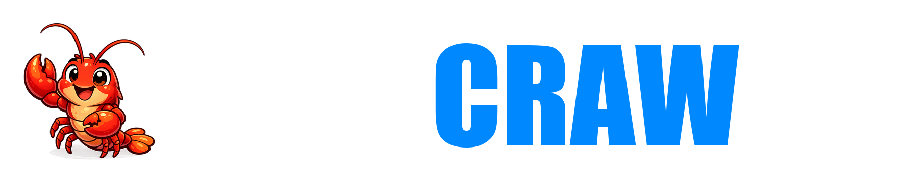

  

  
  

OpenCraw is the heart, Gateway/Assistant, and primary control plane of BBM's
Linux-native Ai Server appliance. It provides the inference, agentic
orchestration, and task-execution interface used to carry out BBM and client
business tasks, including software development.

[CrawDevAi](https://github.com/Branded-Business-Models/CrawDevAi) is the
framework that deploys, updates, validates, recovers, replicates, and
standardizes the OpenCraw-centered appliance. OpenCraw remains a downstream,
OpenClaw-compatible fork with selected operational customizations and the
upstream command, configuration, protocol, package, and state contracts needed
for compatibility.

OpenCraw is based on [OpenClaw](https://github.com/openclaw/openclaw). General
installation, configuration, and usage documentation remains upstream at
[docs.openclaw.ai](https://docs.openclaw.ai); OpenCraw does not duplicate it.
Upstream compatibility is an objective, not a guarantee.

## Linux-native dual-G/A architecture

OpenCraw is optimized and validated as the heart, Gateway/Assistant, and primary
control plane of BBM's Linux-native Ai Server appliance. The BBM reference
architecture operates two separately configured OpenCraw Gateway/Assistant
services:

- **OpenCraw Primary** is the normal user-facing G/A and control plane.
- **OpenCraw Rescue** provides operational continuity and supports restart,
  rebuild, repair, recovery, update, and validation while Primary is unavailable
  or being serviced.

Primary and Rescue use separate service identities, configurations, persistent
state, workspaces, and runtime boundaries. This separation allows one service to
remain available while the other is restarted, rebuilt, repaired, recovered,
updated, or validated.

CrawDevAi is the framework that deploys, updates, validates, recovers,
replicates, and standardizes this OpenCraw-centered appliance. The dual-G/A
topology is BBM's reference and validated appliance architecture; it is not a
requirement for every generic or upstream-compatible OpenCraw installation.

## Crawbie Pincherton

Crawbie Pincherton, also known as CrawCraw, is the Ai crawfish mascot for all
of BBM's Ai development efforts and projects. Under the screen name
`TheRealCrawCraw`, Crawbie is the sole BBM machine identity for BBM-managed
and BBM-developed Ai projects. There is only one `TheRealCrawCraw`; it is
Crawbie, and it works for BBM.

Client, customer, third-party, replicated, and separately owned deployments
use their own isolated identities. They never use, impersonate, inherit, or
receive access to the BBM `TheRealCrawCraw` account or its credentials.

## Fork records

- [Visible-branding boundary](docs/reference/opencraw-branding-boundary.md)
- [Fork reconciliation record](docs/reference/opencraw-fork-reconciliation.md)
- [Validation infrastructure](docs/development/opencraw-validation.md)
- [GitHub Actions policy](docs/reference/github-actions-policy.md)

OpenCraw preserves the upstream MIT license and attribution. See [LICENSE](LICENSE)
and [THIRD_PARTY_NOTICES.md](THIRD_PARTY_NOTICES.md). This software is provided
as-is, without warranty; use it at your own risk.
